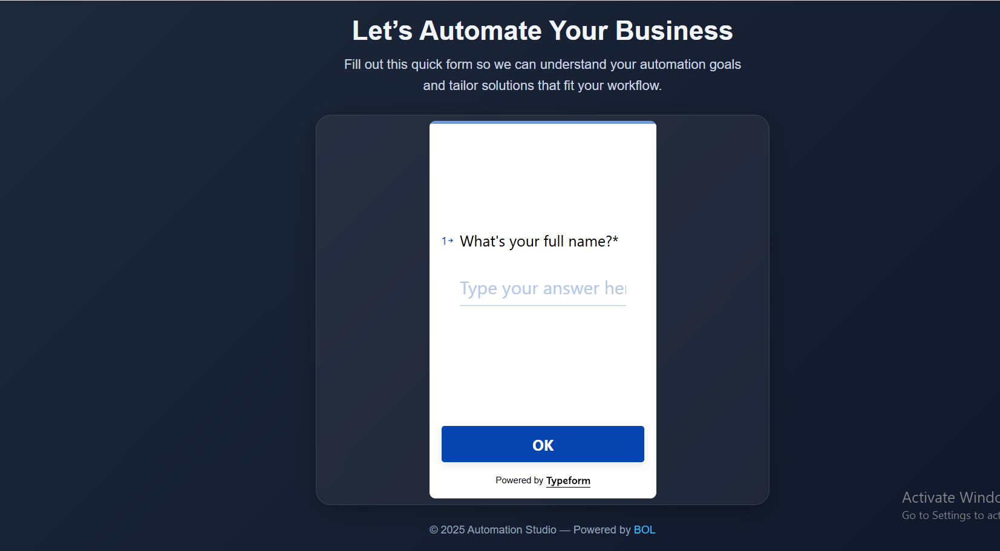
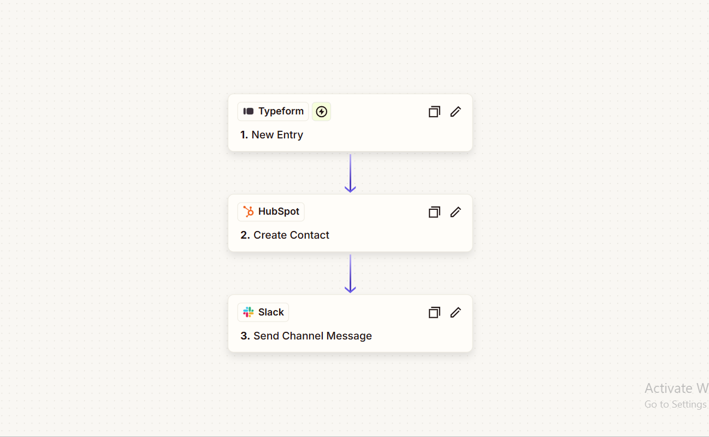

# ⚙️ Let’s Automate Your Business

A modern, professional landing page built to help businesses automate client onboarding and information collection.  
The interface features a sleek **glassmorphism design**, **smooth loader animation**, and an **embedded Typeform** — integrated with **Zapier** and **HubSpot** for powerful workflow automation.

---

## 🎨 UI Design Preview




## ✨ Features

- 🎯 Clean, responsive layout with centered design  
- 💎 Glassmorphism with subtle blur and gradient effects  
- ⏳ Smooth animated loader before form display  
- 🧾 Embedded Typeform for client data collection  
- ⚡ Integrated with **Zapier** for automation workflows  
- 💼 Connected with **HubSpot** for CRM and lead management  
- 🌐 Fully responsive and mobile-friendly  

---

## 🛠️ Tech Stack

- **HTML5**  
- **CSS3** (Glassmorphism + Gradient styling)  
- **Typeform Embed Script**  
- **Zapier** (for automated workflows)  
- **HubSpot CRM** (for lead management)

---


**Zapier Workflow Integration**


---

## 🚀 Getting Started

1. Clone this repository:
   ```bash
   git clone https://github.com/yourusername/lets-automate-your-business.git
